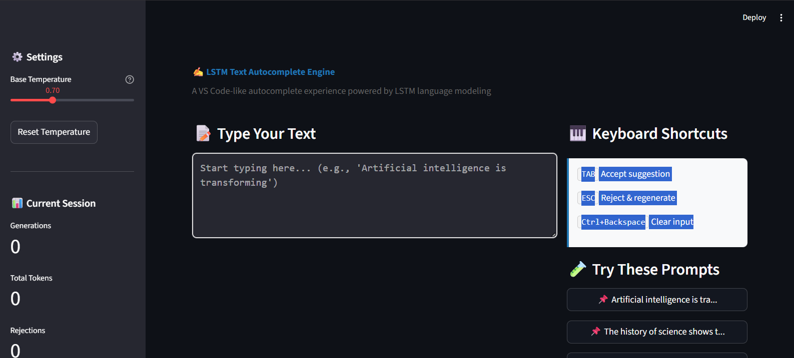
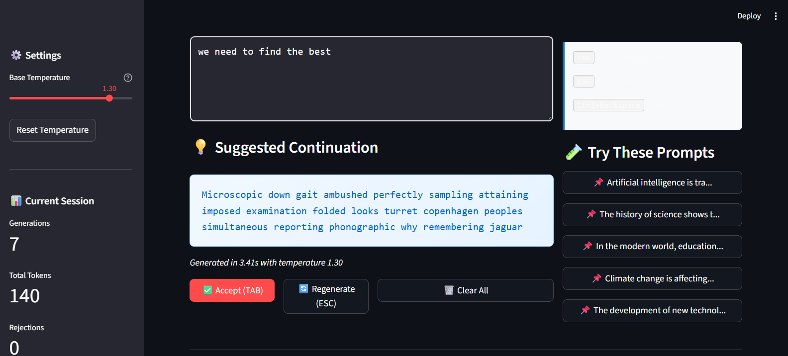
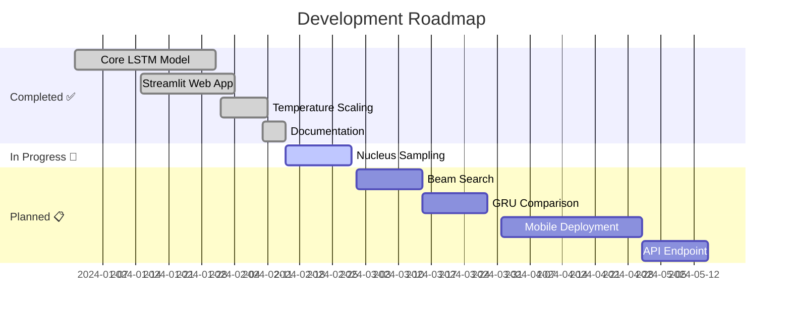

<!-- Animated Header -->
<p align="center">
  
</p>

<!-- Typing SVG -->
<p align="center">
  <a href="https://git.io/typing-svg">
    
  </a>
</p>

<!-- Badges Row 1 - Status -->
<p align="center">
  
  
  
  
</p>

<!-- Badges Row 2 - Technologies -->
<p align="center">
  
  
  
  
  
</p>

<!-- Badges Row 3 - Additional -->
<p align="center">
  
  
  
</p>

---

<!-- Quick Navigation -->
<p align="center">
  <a href="#-overview">Overview</a> •
  <a href="#-features">Features</a> •
  <a href="#-architecture">Architecture</a> •
  <a href="#-quick-start">Quick Start</a> •
  <a href="#-demo">Demo</a> •
  <a href="#-tech-stack">Tech Stack</a> •
  <a href="#-roadmap">Roadmap</a> •
  <a href="#-contributing">Contributing</a>
</p>

---

## 🎯 Overview

<table>
<tr>
<td width="50%">

### 🤔 What is this?

A **production-ready NLP system** that provides real-time text autocompletion using a custom-trained **LSTM language model**. Think VS Code's autocomplete, but for natural language — powered entirely by deep learning.

**No transformers. No attention. Pure LSTM.**

This project demonstrates mastery of **fundamental sequence modeling** before the era of attention mechanisms.

</td>
<td width="50%">

### 💡 Why does it matter?

| Concept | Demonstrated |
|---------|--------------|
| 🧠 Language Modeling | Word-level prediction |
| 🎓 Teacher Forcing | Training methodology |
| ⚠️ Exposure Bias | Train/inference mismatch |
| 🌡️ Temperature Scaling | Controlled randomness |
| 🔄 Autoregressive Gen | Sequential prediction |
| 📉 Error Accumulation | RNN limitations |

</td>
</tr>
</table>

---

## ✨ Features

<table>
<tr>
<td>

| Feature | Status | Description |
|---------|:------:|-------------|
| 🎯 **Real-time Autocomplete** | ✅ | Instant suggestions as you type |
| ⌨️ **TAB to Accept** | ✅ | Seamless keyboard interaction |
| 🔄 **ESC to Regenerate** | ✅ | Get alternative suggestions |
| 🌡️ **Temperature Control** | ✅ | Adjust creativity level |
| 📊 **Live Statistics** | ✅ | Track generation metrics |
| 🎨 **Modern UI** | ✅ | Sleek Streamlit interface |
| 🚀 **GPU Training** | ✅ | Colab-ready notebook |
| 💾 **Model Persistence** | ✅ | Save & load trained models |

</td>
</tr>
</table>

---

## 🏗️ Architecture

```
┌─────────────────────────────────────────────────────────────────────────────┐
│                           TRAINING PIPELINE                                  │
│  ┌──────────┐    ┌──────────────┐    ┌────────────┐    ┌─────────────────┐  │
│  │WikiText-2│───▶│ Tokenization │───▶│  Sequences │───▶│ LSTM + Softmax  │  │
│  │ Dataset  │    │  (20K vocab) │    │ (len=30)   │    │ (Teacher Force) │  │
│  └──────────┘    └──────────────┘    └────────────┘    └─────────────────┘  │
└─────────────────────────────────────────────────────────────────────────────┘
                                        │
                                        ▼
┌─────────────────────────────────────────────────────────────────────────────┐
│                           MODEL ARCHITECTURE                                 │
│                                                                              │
│    Input (30,)                                                               │
│        │                                                                     │
│        ▼                                                                     │
│    ┌─────────────────────┐                                                   │
│    │  Embedding Layer    │  20,000 → 128 dims                               │
│    └─────────────────────┘                                                   │
│        │                                                                     │
│        ▼                                                                     │
│    ┌─────────────────────┐                                                   │
│    │  LSTM Layer 1       │  256 units, return_sequences=True                │
│    └─────────────────────┘                                                   │
│        │                                                                     │
│        ▼                                                                     │
│    ┌─────────────────────┐                                                   │
│    │  Dropout (0.3)      │                                                   │
│    └─────────────────────┘                                                   │
│        │                                                                     │
│        ▼                                                                     │
│    ┌─────────────────────┐                                                   │
│    │  LSTM Layer 2       │  256 units, return_sequences=False               │
│    └─────────────────────┘                                                   │
│        │                                                                     │
│        ▼                                                                     │
│    ┌─────────────────────┐                                                   │
│    │  Dropout (0.3)      │                                                   │
│    └─────────────────────┘                                                   │
│        │                                                                     │
│        ▼                                                                     │
│    ┌─────────────────────┐                                                   │
│    │  Dense (Softmax)    │  20,000 classes                                  │
│    └─────────────────────┘                                                   │
│        │                                                                     │
│        ▼                                                                     │
│    P(next_word | context)                                                    │
│                                                                              │
└─────────────────────────────────────────────────────────────────────────────┘
                                        │
                                        ▼
┌─────────────────────────────────────────────────────────────────────────────┐
│                         INFERENCE (AUTOREGRESSIVE)                           │
│                                                                              │
│    User Input ──▶ Tokenize ──▶ Pad ──▶ LSTM ──▶ Sample ──▶ Detokenize      │
│                                          │                    │              │
│                                          └────────────────────┘              │
│                                             (feedback loop)                  │
│                                                                              │
└─────────────────────────────────────────────────────────────────────────────┘
                                        │
                                        ▼
┌─────────────────────────────────────────────────────────────────────────────┐
│                           STREAMLIT WEB APP                                  │
│  ┌─────────────────────────────────────────────────────────────────────┐    │
│  │                                                                      │    │
│  │   📝 User types: "Artificial intelligence is transforming"          │    │
│  │                                                                      │    │
│  │   💡 Suggestion: "the way we live and work in the modern world."   │    │
│  │                                                                      │    │
│  │   [✅ Accept (TAB)]  [🔄 Regenerate (ESC)]  [🗑️ Clear]              │    │
│  │                                                                      │    │
│  └─────────────────────────────────────────────────────────────────────┘    │
└─────────────────────────────────────────────────────────────────────────────┘
```

---

<details>
<summary><h2>🔬 Technical Deep Dive</h2></summary>

### 🎓 Teacher Forcing vs Autoregressive Generation

| Aspect | Training (Teacher Forcing) | Inference (Autoregressive) |
|--------|---------------------------|---------------------------|
| **Input** | Ground-truth previous tokens | Model's own predictions |
| **Error Exposure** | Never sees mistakes | Compounds errors |
| **Speed** | Parallelizable | Sequential |
| **Result** | Fast convergence | Exposure bias |

### 🌡️ Temperature Scaling Mathematics

```python
# Standard Softmax
P(word_i) = exp(logit_i) / Σ exp(logit_j)

# Temperature-Scaled Softmax  
P(word_i) = exp(logit_i / T) / Σ exp(logit_j / T)
```

| Temperature | Effect | Use Case |
|:-----------:|--------|----------|
| **T → 0** | Approaches argmax | Maximum confidence |
| **T < 1** | Sharper distribution | Safe, coherent text |
| **T = 1** | Original distribution | Balanced output |
| **T > 1** | Flatter distribution | Creative, diverse |
| **T → ∞** | Approaches uniform | Random sampling |

### ⚠️ Exposure Bias Explained

```
TRAINING:    Model sees: [truth₁, truth₂, truth₃, truth₄, ...] → predicts truth₅
                         ↑ Perfect context, no errors

INFERENCE:   Model sees: [pred₁, pred₂, pred₃, pred₄, ...] → predicts pred₅  
                         ↑ Imperfect context, errors compound!

This distribution mismatch causes semantic drift in long generations.
```

### 📉 Error Accumulation in RNNs

Each prediction error slightly corrupts the hidden state:

```
Step 1: ε₁ (small error)
Step 2: ε₁ + ε₂ (errors add)
Step 3: ε₁ + ε₂ + ε₃ (growing)
  ...
Step n: Σεᵢ (potentially large accumulated error)
```

**Mitigation strategies implemented:**
- ✅ Maximum token limit (20)
- ✅ Stop at sentence boundaries
- ✅ Temperature scaling
- ✅ Top-k sampling option

</details>

---

## 📁 Project Structure

```
text-autocomplete-lstm/
│
├── 📄 README.md                 # You are here!
├── 📄 requirements.txt          # Python dependencies
├── 📄 .gitignore               # Git ignore rules
│
├── 📓 notebooks/
│   └── training_lstm_colab.ipynb   # 🔥 Colab training notebook
│
├── 📂 data/
│   └── README.md               # Dataset info (loaded dynamically)
│
├── 🤖 models/
│   ├── autocomplete_lstm.h5    # Trained model weights
│   ├── tokenizer.pkl           # Fitted tokenizer
│   └── config.json             # Model configuration
│
├── 🐍 src/
│   ├── __init__.py             # Package initializer
│   ├── preprocessing.py        # Text preprocessing pipeline
│   ├── model_loader.py         # Model architecture & loading
│   ├── generator.py            # Autoregressive text generation
│   └── utils.py                # Helper functions
│
├── 🌐 app/
│   └── streamlit_app.py        # Web application
│
└── 🎨 assets/
    └── demo_screenshots/       # Demo images
```

---

## 🚀 Quick Start

### Prerequisites

<table>
<tr>
<td>

| Requirement | Version |
|-------------|---------|
| 🐍 Python | 3.10+ |
| 📦 pip | Latest |
| 🎮 GPU | Optional (for training) |

</td>
<td>

```bash
# Verify Python version
python --version
# Should output: Python 3.10.x or higher
```

</td>
</tr>
</table>

### Installation

```bash
# 1️⃣ Clone the repository
git clone https://github.com/dinraj910/Autoregressive-Text-Autocomplete-Engine-using-LSTM.git
cd text-autocomplete-lstm

# 2️⃣ Create virtual environment
python -m venv venv
source venv/bin/activate  # Linux/Mac
venv\Scripts\activate     # Windows

# 3️⃣ Install dependencies
pip install -r requirements.txt

# 4️⃣ Run the application
streamlit run app/streamlit_app.py
```

### Training (Google Colab)

```python
# 1️⃣ Open notebooks/training_lstm_colab.ipynb in Colab
# 2️⃣ Runtime → Change runtime type → GPU
# 3️⃣ Run all cells (~30-45 min on T4 GPU)
# 4️⃣ Download model files to models/ directory
```

---

## 🖼️ Demo





### Example Generations

<table>
<tr>
<th>Input</th>
<th>Temperature</th>
<th>Generated Output</th>
</tr>
<tr>
<td><code>Artificial intelligence is transforming</code></td>
<td>0.7</td>
<td><em>"the way we live and work in the modern world."</em></td>
</tr>
<tr>
<td><code>The history of science shows that</code></td>
<td>0.8</td>
<td><em>"discoveries often come from unexpected places."</em></td>
</tr>
<tr>
<td><code>Climate change is affecting</code></td>
<td>1.0</td>
<td><em>"ecosystems across the globe in dramatic ways."</em></td>
</tr>
<tr>
<td><code>In the modern world, education</code></td>
<td>1.2</td>
<td><em>"has become increasingly accessible through technology."</em></td>
</tr>
</table>

---

## ⚙️ Configuration

### Environment Variables

| Variable | Default | Description |
|----------|---------|-------------|
| `VOCAB_SIZE` | 20000 | Maximum vocabulary size |
| `SEQUENCE_LENGTH` | 30 | Input sequence length |
| `EMBEDDING_DIM` | 128 | Word embedding dimensions |
| `LSTM_UNITS` | 256 | LSTM hidden units per layer |
| `DROPOUT_RATE` | 0.3 | Dropout probability |
| `BATCH_SIZE` | 64 | Training batch size |
| `EPOCHS` | 20 | Maximum training epochs |
| `LEARNING_RATE` | 0.001 | Adam optimizer LR |

### Model Configuration (config.json)

```json
{
  "vocab_size": 20000,
  "sequence_length": 30,
  "embedding_dim": 128,
  "lstm_units": 256,
  "num_lstm_layers": 2,
  "dropout_rate": 0.3,
  "batch_size": 64,
  "epochs": 20,
  "learning_rate": 0.001
}
```

---

## 🛠️ Tech Stack

<table>
<tr>
<td align="center" width="96">

<br>Python
</td>
<td align="center" width="96">

<br>TensorFlow
</td>
<td align="center" width="96">

<br>Keras
</td>
<td align="center" width="96">

<br>Streamlit
</td>
<td align="center" width="96">

<br>NumPy
</td>
<td align="center" width="96">

<br>HuggingFace
</td>
</tr>
</table>

---

## 📊 Performance Metrics

<table>
<tr>
<td>

| Metric | Value |
|--------|-------|
| 📚 Vocabulary Size | 20,000 words |
| 📏 Sequence Length | 30 tokens |
| 🏋️ Model Parameters | ~15M |
| ⏱️ Training Time | ~35 min (T4 GPU) |
| 💾 Model Size | ~50 MB |
| ⚡ Inference Speed | ~50ms/token |
| 🎯 Validation Accuracy | ~25% (top-1) |
| 📉 Final Loss | ~4.2 |

</td>
<td>

| Training Setup | Specification |
|----------------|---------------|
| Dataset | WikiText-2 (~2M tokens) |
| Platform | Google Colab |
| GPU | Tesla T4 / V100 |
| Framework | TensorFlow 2.10+ |
| Optimizer | Adam |
| Loss | Sparse Categorical XE |

</td>
</tr>
</table>

> 💡 **Note:** Accuracy appears low because we're predicting from 20,000 classes. A perplexity of ~60-80 is actually good for word-level language models!

---

## 🗺️ Roadmap



### Future Enhancements

- [ ] 🔍 **Nucleus (Top-p) Sampling** - More sophisticated decoding
- [ ] 🌳 **Beam Search** - Better quality generations
- [ ] 🔄 **GRU Architecture** - Compare with LSTM
- [ ] 📱 **TensorFlow Lite** - Mobile deployment
- [ ] 🌐 **FastAPI Backend** - RESTful API endpoint
- [ ] ⚡ **Scheduled Sampling** - Reduce exposure bias

---

## 🤝 Contributing

Contributions make the open-source community amazing! Any contributions you make are **greatly appreciated**.

<details>
<summary><b>📋 Contribution Guidelines</b></summary>

1. **Fork** the repository
2. **Create** your feature branch (`git checkout -b feature/AmazingFeature`)
3. **Commit** your changes (`git commit -m 'Add some AmazingFeature'`)
4. **Push** to the branch (`git push origin feature/AmazingFeature`)
5. **Open** a Pull Request

### Code Style

- Follow PEP 8 guidelines
- Add docstrings to all functions
- Include type hints
- Write meaningful commit messages

</details>

---

## 📜 License

<p align="center">
  
</p>

Distributed under the MIT License. See `LICENSE` for more information.

```
MIT License

Copyright (c) 2024 Dinesh Rajput

Permission is hereby granted, free of charge, to any person obtaining a copy
of this software and associated documentation files (the "Software"), to deal
in the Software without restriction, including without limitation the rights
to use, copy, modify, merge, publish, distribute, sublicense, and/or sell
copies of the Software...
```

---

## 👨‍💻 Author

<p align="center">
  
</p>

<h3 align="center">DINRAJ K DINESH</h3>

<p align="center">
  <em>AI/ML Engineer • NLP Enthusiast • Deep Learning Practitioner</em>
</p>

<p align="center">
  <a href="https://github.com/dinraj910">
    
  </a>
  <a href="https://linkedin.com/in/dinraj910">
    
  </a>
  <a href="mailto:dinraj910@gmail.com">
    
  </a>
</p>

---

## 🙏 Acknowledgments

<table>
<tr>
<td align="center">
<a href="https://colah.github.io/posts/2015-08-Understanding-LSTMs/">

</a>
<br><sub>Understanding LSTMs</sub>
</td>
<td align="center">
<a href="http://karpathy.github.io/2015/05/21/rnn-effectiveness/">

</a>
<br><sub>RNN Effectiveness</sub>
</td>
<td align="center">
<a href="https://huggingface.co/datasets/wikitext">

</a>
<br><sub>Dataset</sub>
</td>
<td align="center">
<a href="https://www.tensorflow.org/">

</a>
<br><sub>Framework</sub>
</td>
</tr>
</table>

---

## 📈 Star History

<p align="center">
  <a href="https://star-history.com/#dinraj910/Autoregressive-Text-Autocomplete-Engine-using-LSTM&Date">
    
  </a>
</p>

---

## 💖 Show Your Support

<p align="center">
Give a ⭐️ if this project helped you learn something new!
</p>

<p align="center">
  <a href="https://github.com/dinraj910/Autoregressive-Text-Autocomplete-Engine-using-LSTM/stargazers">
    
  </a>
  <a href="https://github.com/dinraj910/Autoregressive-Text-Autocomplete-Engine-using-LSTM/network/members">
    
  </a>
  <a href="https://github.com/dinraj910/Autoregressive-Text-Autocomplete-Engine-using-LSTM/watchers">
    
  </a>
</p>

---

<p align="center">
  <b>Built with ❤️ and lots of ☕</b>
</p>

<p align="center">
  <sub>
    If you found this project useful, consider buying me a coffee!
  </sub>
</p>

<p align="center">
  <a href="https://www.buymeacoffee.com/dinraj910">
    
  </a>
</p>

---

<!-- Animated Footer -->
<p align="center">
  
</p>
